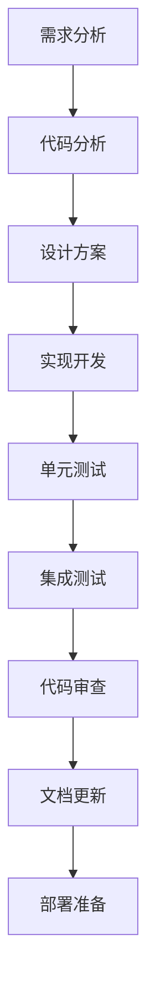

# HAJIMI项目AI协作工作流程

## 协作模式定义

### 1. 角色分工

#### AI助手角色
- **代码分析师**: 分析现有代码结构和逻辑
- **功能开发者**: 实现新功能和特性
- **测试工程师**: 编写和执行测试用例
- **文档维护者**: 更新和维护项目文档
- **性能优化师**: 识别和解决性能问题
- **安全审查员**: 检查安全漏洞和最佳实践

#### 人类开发者角色
- **架构决策者**: 做出重大架构决策
- **需求定义者**: 明确功能需求和优先级
- **代码审查者**: 审查AI生成的代码
- **部署管理者**: 管理生产环境部署

### 2. 协作工作流程

#### 标准开发流程


#### 具体步骤说明

##### 步骤1: 需求分析
```markdown
**AI助手任务**:
1. 分析用户需求描述
2. 识别涉及的模块和组件
3. 评估实现复杂度
4. 提出实现方案选项

**输出格式**:
- 需求理解确认
- 技术可行性分析
- 实现方案建议
- 风险评估
```

##### 步骤2: 代码分析
```python
# AI助手代码分析模板
def analyze_codebase_for_feature(feature_description: str):
    """
    分析代码库以支持新功能实现
    
    Args:
        feature_description: 功能描述
    
    Returns:
        分析报告包含:
        - 相关文件列表
        - 依赖关系图
        - 修改点识别
        - 影响范围评估
    """
    analysis_report = {
        "related_files": [],
        "dependencies": {},
        "modification_points": [],
        "impact_assessment": {}
    }
    
    # 1. 识别相关文件
    # 2. 分析依赖关系
    # 3. 确定修改点
    # 4. 评估影响范围
    
    return analysis_report
```

##### 步骤3: 设计方案
```python
# 设计方案模板
class FeatureDesign:
    def __init__(self, feature_name: str):
        self.feature_name = feature_name
        self.components = []
        self.interfaces = []
        self.data_models = []
        self.configuration = {}
    
    def add_component(self, component: dict):
        """添加组件设计"""
        required_fields = ['name', 'responsibility', 'interfaces', 'dependencies']
        if all(field in component for field in required_fields):
            self.components.append(component)
    
    def add_interface(self, interface: dict):
        """添加接口设计"""
        required_fields = ['name', 'methods', 'parameters', 'returns']
        if all(field in interface for field in required_fields):
            self.interfaces.append(interface)
    
    def generate_implementation_plan(self) -> dict:
        """生成实现计划"""
        return {
            "phases": [
                {"phase": 1, "tasks": ["数据模型定义", "核心接口实现"]},
                {"phase": 2, "tasks": ["业务逻辑实现", "错误处理"]},
                {"phase": 3, "tasks": ["测试编写", "文档更新"]}
            ],
            "estimated_effort": "计算预估工作量",
            "risk_factors": ["识别风险因素"]
        }
```

##### 步骤4: 实现开发
```python
# 开发实现规范
class DevelopmentStandards:
    """开发标准和规范"""
    
    @staticmethod
    def code_structure_template():
        """代码结构模板"""
        return """
        # 文件头部注释
        '''
        模块名称: {module_name}
        功能描述: {description}
        作者: AI Assistant
        创建时间: {timestamp}
        修改历史: {change_log}
        '''
        
        # 导入语句 (按标准顺序)
        import standard_library
        import third_party_library
        from app.module import local_module
        
        # 常量定义
        CONSTANT_NAME = "value"
        
        # 类型定义
        from typing import Optional, Dict, List
        
        # 主要实现
        class FeatureImplementation:
            def __init__(self):
                pass
            
            async def main_method(self) -> dict:
                '''主要方法实现'''
                pass
        """
    
    @staticmethod
    def error_handling_pattern():
        """错误处理模式"""
        return """
        try:
            # 主要逻辑
            result = await some_operation()
            return result
        except SpecificException as e:
            # 特定异常处理
            log('warning', f"特定错误: {str(e)}")
            raise HTTPException(status_code=400, detail="具体错误信息")
        except Exception as e:
            # 通用异常处理
            log('error', f"未预期错误: {str(e)}")
            raise HTTPException(status_code=500, detail="内部服务器错误")
        """
    
    @staticmethod
    def logging_pattern():
        """日志记录模式"""
        return """
        from app.utils.logging import log
        
        # 信息日志
        log('info', "操作开始", extra={'operation': 'feature_name', 'user_id': user_id})
        
        # 警告日志
        log('warning', "潜在问题", extra={'issue': 'description', 'context': context_data})
        
        # 错误日志
        log('error', "操作失败", extra={'error': str(e), 'traceback': traceback.format_exc()})
        """
```

##### 步骤5: 测试策略
```python
# 测试实现模板
import pytest
import asyncio
from unittest.mock import AsyncMock, patch, MagicMock

class TestFeatureImplementation:
    """功能测试类"""
    
    @pytest.fixture
    async def setup_test_environment(self):
        """测试环境设置"""
        # 设置测试数据
        test_data = {
            "api_key": "test_key_12345678",
            "model": "gemini-2.5-pro",
            "request_data": {"test": "data"}
        }
        return test_data
    
    @pytest.mark.asyncio
    async def test_happy_path(self, setup_test_environment):
        """测试正常流程"""
        # 准备
        test_data = setup_test_environment
        
        # 模拟依赖
        with patch('app.services.gemini.httpx.AsyncClient') as mock_client:
            mock_response = AsyncMock()
            mock_response.json.return_value = {"success": True}
            mock_response.status_code = 200
            mock_client.return_value.__aenter__.return_value.post.return_value = mock_response
            
            # 执行
            result = await feature_function(test_data)
            
            # 验证
            assert result is not None
            assert result["success"] is True
    
    @pytest.mark.asyncio
    async def test_error_handling(self, setup_test_environment):
        """测试错误处理"""
        test_data = setup_test_environment
        
        # 模拟错误情况
        with patch('app.services.gemini.httpx.AsyncClient') as mock_client:
            mock_client.return_value.__aenter__.return_value.post.side_effect = Exception("API Error")
            
            # 执行并验证异常
            with pytest.raises(HTTPException) as exc_info:
                await feature_function(test_data)
            
            assert exc_info.value.status_code == 500
    
    @pytest.mark.asyncio
    async def test_edge_cases(self, setup_test_environment):
        """测试边界情况"""
        # 测试空输入
        result = await feature_function({})
        assert result is not None
        
        # 测试大数据量
        large_data = {"data": "x" * 10000}
        result = await feature_function(large_data)
        assert result is not None
    
    def test_performance(self, setup_test_environment):
        """性能测试"""
        import time
        
        start_time = time.time()
        # 执行性能测试
        end_time = time.time()
        
        execution_time = end_time - start_time
        assert execution_time < 1.0  # 确保在1秒内完成
```

### 3. 协作沟通规范

#### 需求澄清模板
```markdown
## 需求澄清

### 当前理解
我理解您希望实现的功能是: [功能描述]

### 技术分析
- **涉及模块**: [列出相关模块]
- **实现复杂度**: [简单/中等/复杂]
- **预估工作量**: [小时数或天数]

### 实现方案
1. **方案A**: [描述方案A]
   - 优点: [列出优点]
   - 缺点: [列出缺点]
   
2. **方案B**: [描述方案B]
   - 优点: [列出优点]
   - 缺点: [列出缺点]

### 需要确认的问题
1. [问题1]
2. [问题2]
3. [问题3]

### 建议
基于分析，我建议采用方案[A/B]，因为[原因]。
```

#### 进度报告模板
```markdown
## 开发进度报告

### 已完成任务
- [x] 任务1: [描述] - 完成时间: [时间]
- [x] 任务2: [描述] - 完成时间: [时间]

### 进行中任务
- [ ] 任务3: [描述] - 预计完成: [时间]
- [ ] 任务4: [描述] - 预计完成: [时间]

### 遇到的问题
1. **问题**: [问题描述]
   - **影响**: [影响程度]
   - **解决方案**: [解决方案]
   - **需要帮助**: [是否需要人工介入]

### 下一步计划
1. [下一步任务1]
2. [下一步任务2]

### 风险提醒
- [风险1]: [描述和缓解措施]
- [风险2]: [描述和缓解措施]
```

### 4. 质量保证流程

#### 代码审查清单
```markdown
## AI生成代码审查清单

### 功能性检查
- [ ] 功能实现符合需求
- [ ] 边界条件处理正确
- [ ] 错误处理完整
- [ ] 返回值类型正确

### 代码质量检查
- [ ] 代码结构清晰
- [ ] 命名规范一致
- [ ] 注释充分且准确
- [ ] 类型注解完整

### 性能检查
- [ ] 无明显性能问题
- [ ] 资源使用合理
- [ ] 异步操作正确
- [ ] 缓存策略适当

### 安全检查
- [ ] 输入验证充分
- [ ] 敏感信息处理正确
- [ ] 权限检查到位
- [ ] SQL注入防护

### 兼容性检查
- [ ] 向后兼容性保持
- [ ] API接口稳定
- [ ] 配置项兼容
- [ ] 数据格式兼容

### 测试覆盖
- [ ] 单元测试充分
- [ ] 集成测试覆盖
- [ ] 错误场景测试
- [ ] 性能测试包含
```

#### 自动化检查脚本
```python
#!/usr/bin/env python3
"""
AI代码质量自动检查脚本
"""

import ast
import os
import re
from typing import List, Dict, Any

class CodeQualityChecker:
    """代码质量检查器"""
    
    def __init__(self, file_path: str):
        self.file_path = file_path
        self.issues = []
    
    def check_all(self) -> Dict[str, Any]:
        """执行所有检查"""
        with open(self.file_path, 'r', encoding='utf-8') as f:
            content = f.read()
        
        # 解析AST
        try:
            tree = ast.parse(content)
        except SyntaxError as e:
            return {"error": f"语法错误: {e}"}
        
        # 执行各项检查
        self.check_imports(tree)
        self.check_functions(tree)
        self.check_classes(tree)
        self.check_error_handling(content)
        self.check_logging(content)
        self.check_type_hints(tree)
        
        return {
            "file": self.file_path,
            "issues": self.issues,
            "score": self.calculate_score()
        }
    
    def check_imports(self, tree: ast.AST):
        """检查导入语句"""
        imports = []
        for node in ast.walk(tree):
            if isinstance(node, (ast.Import, ast.ImportFrom)):
                imports.append(node)
        
        # 检查导入顺序
        # 检查未使用的导入
        # 检查循环导入
        pass
    
    def check_functions(self, tree: ast.AST):
        """检查函数定义"""
        for node in ast.walk(tree):
            if isinstance(node, ast.FunctionDef):
                # 检查函数长度
                if len(node.body) > 50:
                    self.issues.append(f"函数 {node.name} 过长 ({len(node.body)} 行)")
                
                # 检查参数数量
                if len(node.args.args) > 5:
                    self.issues.append(f"函数 {node.name} 参数过多 ({len(node.args.args)} 个)")
                
                # 检查文档字符串
                if not ast.get_docstring(node):
                    self.issues.append(f"函数 {node.name} 缺少文档字符串")
    
    def check_error_handling(self, content: str):
        """检查错误处理"""
        # 检查是否有裸露的except
        if re.search(r'except\s*:', content):
            self.issues.append("发现裸露的except语句")
        
        # 检查是否有适当的异常处理
        try_count = len(re.findall(r'\btry\b', content))
        except_count = len(re.findall(r'\bexcept\b', content))
        
        if try_count > except_count:
            self.issues.append("try语句多于except语句")
    
    def calculate_score(self) -> int:
        """计算代码质量分数"""
        base_score = 100
        penalty_per_issue = 5
        return max(0, base_score - len(self.issues) * penalty_per_issue)

# 使用示例
def check_code_quality(file_path: str) -> Dict[str, Any]:
    """检查代码质量"""
    checker = CodeQualityChecker(file_path)
    return checker.check_all()
```

### 5. 持续改进机制

#### 反馈收集
```python
class CollaborationFeedback:
    """协作反馈收集"""
    
    def __init__(self):
        self.feedback_data = []
    
    def collect_feedback(self, task_id: str, feedback: dict):
        """收集反馈"""
        feedback_entry = {
            "task_id": task_id,
            "timestamp": datetime.now().isoformat(),
            "feedback": feedback,
            "ai_performance": feedback.get("ai_performance", {}),
            "code_quality": feedback.get("code_quality", {}),
            "collaboration_effectiveness": feedback.get("collaboration_effectiveness", {})
        }
        self.feedback_data.append(feedback_entry)
    
    def analyze_trends(self) -> dict:
        """分析反馈趋势"""
        if not self.feedback_data:
            return {"message": "暂无反馈数据"}
        
        # 分析AI性能趋势
        performance_scores = [f["ai_performance"].get("score", 0) for f in self.feedback_data]
        avg_performance = sum(performance_scores) / len(performance_scores)
        
        # 分析代码质量趋势
        quality_scores = [f["code_quality"].get("score", 0) for f in self.feedback_data]
        avg_quality = sum(quality_scores) / len(quality_scores)
        
        return {
            "average_ai_performance": avg_performance,
            "average_code_quality": avg_quality,
            "total_feedback_count": len(self.feedback_data),
            "improvement_suggestions": self.generate_suggestions()
        }
    
    def generate_suggestions(self) -> List[str]:
        """生成改进建议"""
        suggestions = []
        
        # 基于反馈数据生成建议
        recent_feedback = self.feedback_data[-10:]  # 最近10条反馈
        
        # 分析常见问题
        common_issues = {}
        for feedback in recent_feedback:
            issues = feedback.get("issues", [])
            for issue in issues:
                common_issues[issue] = common_issues.get(issue, 0) + 1
        
        # 生成针对性建议
        for issue, count in sorted(common_issues.items(), key=lambda x: x[1], reverse=True):
            if count >= 3:  # 出现3次以上的问题
                suggestions.append(f"需要重点关注: {issue} (出现{count}次)")
        
        return suggestions
```

### 6. 协作最佳实践

#### 沟通最佳实践
1. **明确需求**: 在开始开发前确保需求理解一致
2. **及时反馈**: 遇到问题及时沟通，不要等到最后
3. **文档先行**: 重要决策和设计要有文档记录
4. **代码审查**: 所有AI生成的代码都需要人工审查
5. **测试驱动**: 先写测试，再实现功能

#### 开发最佳实践
1. **小步迭代**: 将大功能拆分为小的可验证的步骤
2. **版本控制**: 每个功能点都要有清晰的提交记录
3. **错误处理**: 充分考虑各种异常情况
4. **性能考虑**: 在设计阶段就考虑性能影响
5. **安全第一**: 所有用户输入都要验证和清理

#### 质量保证最佳实践
1. **自动化测试**: 建立完善的自动化测试体系
2. **代码审查**: 建立代码审查流程和标准
3. **持续集成**: 使用CI/CD确保代码质量
4. **监控告警**: 建立生产环境监控和告警
5. **文档维护**: 保持文档与代码同步更新

这个工作流程文档为AI助手和人类开发者提供了清晰的协作框架，确保高效和高质量的协作开发。